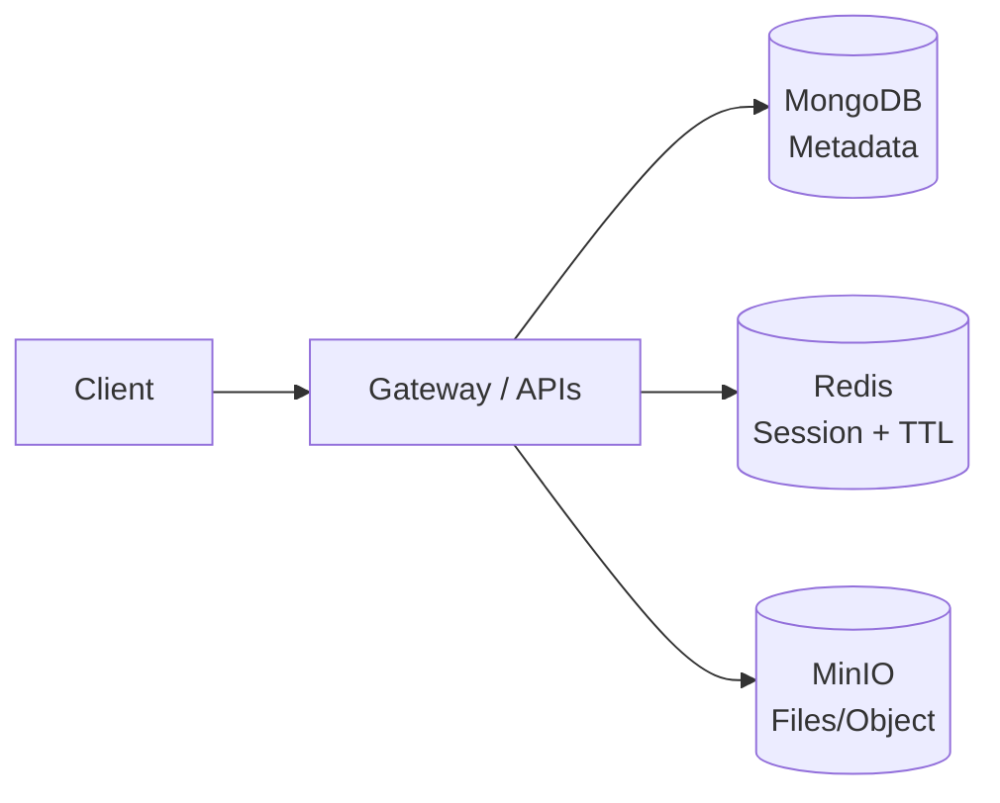
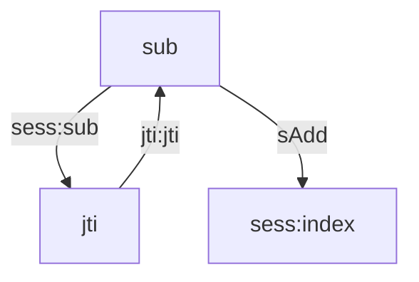

## 3 quick takeaways

I split CaaS data by its “personality”: **MongoDB** for metadata, **Redis** for sessions with TTL, and **MinIO** for student submission files.

- Sessions: instead of allowing “unlimited concurrent logins”, I moved to **one active session per user**, and I **prefer keeping the current session** to avoid an endless kick loop.
- Files: instead of zipping a whole folder into a single object, I switched to **storing individual files under a prefix**, so the UI can fetch exactly what it needs without download–unzip overhead.

## When I realized “one DB for everything” doesn’t work

At the beginning, I thought data was just “records”. But once I went deeper, CaaS clearly had at least three data types with very different lifecycles:

- **Metadata**: users, classes, assignments, deadlines… changing as features evolve.
- **Sessions**: hot-path data that must expire cleanly and be revocable fast.
- **Files**: submissions and artifacts — heavy I/O and can grow quickly.

If you force everything into one place, the system tends to bottleneck in the wrong layer: the database has to serve business queries, handle session churn, and absorb file I/O — and once one workload spikes, it drags the whole system down.

So I went with **polyglot persistence**: store each data type in the storage engine that fits it best.



## MongoDB: where I let the domain evolve without punishing myself

MongoDB is a **NoSQL** database in the **document database** family.

- Data is stored as **documents** (JSON/BSON)
- **Flexible schema**: records don’t need a fixed “column set” like SQL
- Horizontal scaling via replication/sharding
- Great fit for backend/microservice domains that change quickly

For CaaS, metadata changes all the time as the project grows: I started with just `User` and `ClassRoom`, then “ops reality” arrived — class lifecycle states, runtime configs, theory/exam modes, assignment–submission relationships… If I had chosen a rigid schema too early, every new field would have forced a “data cleanup sprint” and slowed down iteration.

What helped me most was **iteration speed**:

- There were phases where I added/removed fields frequently to match how the system actually runs (especially around classroom lifecycle).
- I could add new seed data to test new features **without wiping old data** or writing heavy migrations like “update every record to include the new field”.
- Old documents missing new fields still worked because I kept sensible defaults/optionals in the model/service layers. When needed, I could backfill gradually through business flows instead of stopping everything for a bulk update.

In short: while I was still shaping the product and architecture at the same time, I needed a DB that let the domain change without breaking my workflow.

**User**

```json
{
  "_id": "ObjectId",
  "email": "user@example.com",
  "role": "student | teacher | admin",
  "profileType": "Student | Teacher",
  "profileId": "ObjectId",
  "createdAt": "Date"
}
```

**ClassRoom**

```json
{
  "_id": "ObjectId",
  "name": "Web Backend - K17",
  "teacherId": "ObjectId",
  "status": "pending | running | stopped",
  "runtimeConfig": { "theoryPort": 30010, "examPort": 30011 }
}
```

**Submission metadata (note: reference only)**

```json
{
  "_id": "ObjectId",
  "studentId": "ObjectId",
  "homeworkId": "ObjectId",
  "objectKey": "students/<classId>/<hwId>/<studentId>/main.py",
  "createdAt": "Date"
}
```

I intentionally keep MongoDB “light”: metadata + references. The actual file contents are handled by MinIO.

### Trade-offs (MongoDB)

- Flexible schema makes iteration fast, but without discipline models can become “blurry”: duplicated meaning, inconsistent naming, and implicit contracts.
- My guardrails: consistent field naming, grouping fields by intent (identity, lifecycle, runtime…), and a strict rule of “Mongo for metadata + references; binaries go to object storage”.

## Redis: “one user – one session”, and why I don’t auto-kick the old session

This is a very real problem I hit once the system started feeling “production-like”.

### What bothered me

Before Redis, the same account could stay logged in on multiple devices for a while, and I had a hard time knowing how many users were actually online.

More importantly: from the client perspective, if a password leaks, someone else can log in and “mess with” the real user — actions from one session affect the other. I needed a proper per-user **session** concept so I could control access.

### Two options, and the trap of an endless kick loop

When I decided “one active session per user”, I had two options:

- **Kick the current session and keep the new one**: sounds reasonable… until you imagine two people fighting. They keep logging in repeatedly and the system becomes an infinite loop of kicking.
- **Keep the current session and reject the new one (my choice)**: if the old session is stuck (no logout), it expires via TTL. Admin can also revoke it when needed.

I chose the second direction because my goal was stability and control: “the active session is the truth”, and a new login should not constantly override it.

### Session store design (simple enough to debug)

Key patterns I use:

- `sess:<sub> -> jti`: which session is active for this user
- `jti:<jti> -> sub`: reverse lookup for quick revoke
- `sess:index`: a set to list online users (admin/audit)



### Core snippet: “reserve first, commit later” + TTL

```js
// If the user already has a session => do not create a new one (keep current session)
export async function reserveSession(sub, ttlSec) {
  const key = `sess:${sub}`;
  const pending = `PENDING-${Date.now()}`;

  // NX: set only if it doesn't exist => if a session exists, this fails
  // EX: TTL cleans up automatically if pending is abandoned
  const ok = await redis.set(key, pending, { NX: true, EX: ttlSec });
  return ok === "OK" ? pending : null;
}

export async function commitSession(sub, jti, ttlSec, expectedPending) {
  const key = `sess:${sub}`;
  const current = await redis.get(key);
  if (current !== expectedPending) return false;

  // Real session + reverse index + online index
  await redis.set(key, jti, { EX: ttlSec });
  await redis.set(`jti:${jti}`, sub, { EX: ttlSec });
  await redis.sAdd("sess:index", sub);
  return true;
}
```

What I like about this approach is that TTL is attached to the session lifecycle from the moment it’s created. And since I keep the current session, the system avoids an infinite “kick war” if someone keeps trying to log in repeatedly.

### Trade-offs (Redis: single session)

- Keeping the current session can frustrate legitimate users who actually want to sign in on a new device immediately.
- In exchange, it blocks the worst-case scenario: two people causing an endless loop by logging in repeatedly.

## MinIO: from “zip the whole folder” to “store files individually” to make the UI lighter

My MinIO pain came from something very practical: everything looked fine in tests — until I wired up the frontend.

### What I did first

When seeding data and checking it via MinIO’s UI, storing a student’s entire submission folder as a single zipped object looked clean:

- upload one zip file
- easier “one object per submission” management

But once the frontend was connected, reality hit: MinIO isn’t a file explorer for your app. You can’t “directly view” a file inside a zip the way you would on a local filesystem.

To display one specific file, the flow became bulky:

- download the zip
- unzip it
- locate the exact file
- render it

This is heavy, slow, and forces the frontend to cache and process data it doesn’t need.

### What I changed: store individual files under a prefix

I switched to storing each file individually, while keeping a strict prefix convention so it doesn’t get messy.

Examples:

- `students/<classId>/<hwId>/<studentId>/main.py`
- `students/<classId>/<hwId>/<studentId>/README.md`

It creates more objects, but the UI becomes much lighter: fetch exactly the file you want — no download–unzip overhead.

### Snippet: fetch exactly the file the UI needs via `objectKey`

```js
// Upload a single file
await minio.putObject("students", objectKey, fileBuffer);

// Save the reference in MongoDB
await SubmissionFile.create({ studentId, homeworkId, objectKey });

// When the FE needs one specific file:
const stream = await minio.getObject("students", objectKey);
return stream;

// For listing files, I simply list by prefix:
const objects = await listObjectsV2(
  "students",
  `students/${classId}/${hwId}/${studentId}/`
);
```

(The idea: the prefix becomes a logical “folder”, making queries simple and predictable.)

### Trade-offs (MinIO: individual files)

- Storing files individually creates more objects, and without a clear prefix convention it can get chaotic.
- In return, the FE benefits a lot: it can fetch exactly what it needs, without zip download + extraction.
- How I keep it under control:
  - Standardize `objectKey` by prefix (classId/homeworkId/studentId/…)
  - Keep responsibilities clear: MongoDB stores metadata; MinIO stores file contents
  - If the scale grows: apply lifecycle/cleanup policies by deadline or class policy

## What changed after these two decisions

I’m not claiming a precise “X% faster” number here, because that requires proper benchmarking (p95/p99). But from a practical standpoint, the improvements were clear:

- I can see online users (via the session index) and I have a revoke mechanism.
- I avoid the “endless kick war” scenario when someone tries to log in repeatedly.
- UI file viewing is smoother because it no longer downloads + unzips just to view a small file.
- The business DB stays lighter: it keeps metadata + references, while the real file contents live in object storage.
