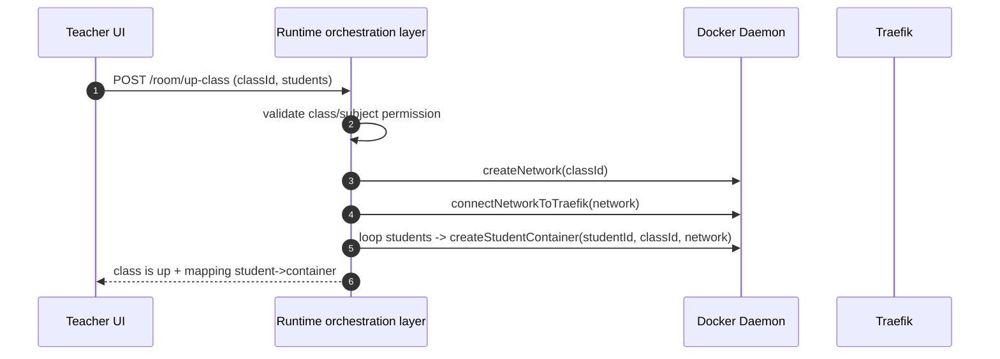
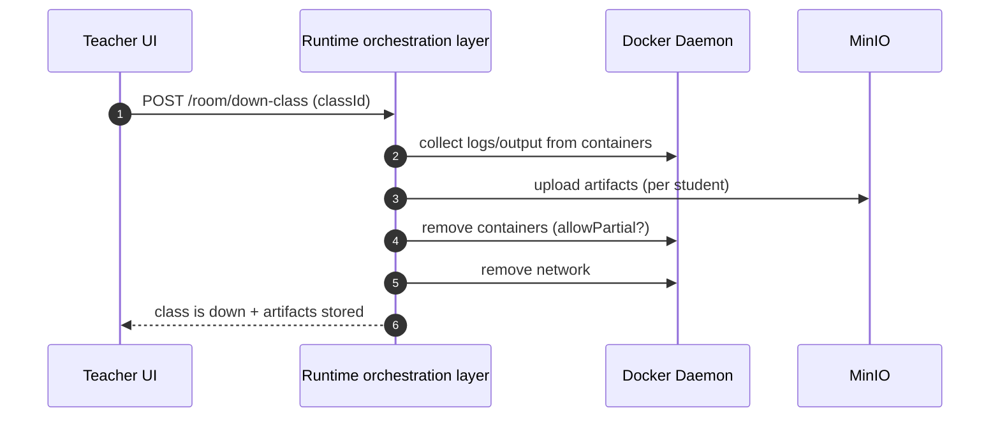

## TL;DR

- There is **no public “create container” endpoint**. The system only supports two domain actions: **Up class** and **Down class**.
- **Up class** = create an isolated class network → attach Traefik → provision one container per student from an allowed template list.
- **Down class** = **collect first** (logs/output → upload to MinIO) and then clean up containers/network to avoid losing submissions.

> If you’re looking for “a cloud-like API that lets users create arbitrary containers”, this post is not that. This is **controlled orchestration** for a classroom environment.

---

## Bridging from Post 2: once data is in the right place, how do we control runtime?

In **Post 2**, I focused on placing data where it naturally belongs:

- MongoDB for **metadata**
- Redis for **sessions with TTL**
- MinIO for **files/artifacts** stored by prefix (so the UI can fetch only what it needs)

The next practical question is:

> Storage is done. Now how do we bring a sandbox runtime (Docker) up and down safely? Who is allowed to do it? And how can a Node.js service talk to Docker Daemon without breaking the permission boundary?

This post answers the runtime part.

---

## Terms used in this post

Inside the repository, the runtime component lives in a service named `class-api`. For readers who haven’t seen the repo yet, I’ll refer to it by its technical role:

- **Runtime orchestration layer**: an internal service that controls Docker lifecycle (network, container, routing) based on classroom domain rules.

From here on, I’ll say “runtime orchestration layer” to describe that component.

---

## Context: education CaaS is not the same as cloud CaaS

At first, container orchestration sounds like: “let users create a container and run code.”

But in a classroom setting, the constraints are different:

- Students must be able to work **inside** a sandbox, but they **must not be able to create containers**.
- Teachers can “bring a class up”, but they **cannot provision anything arbitrarily**. Provisioning must be tied to:
  - registered classes/subjects
  - the official student roster

So the goal here isn’t “Kubernetes-style orchestration”. The goal is:

**Controlled provisioning**: Docker power exists, but only through domain actions (**Up/Down class**).

---

## Why exposing a “Create Container API” breaks the system

A generic endpoint like `POST /containers` (accepting arbitrary `image/cmd/env`) is tempting—but it quickly becomes dangerous:

- The permission boundary disappears: anyone who can hit the API can create containers.
- Domain ownership is lost: which class/student does a container belong to? why was it created?
- Cleanup becomes unreliable: you can’t safely “tear down a class” if you don’t know what belongs to that class.

In short:

**An education-oriented CaaS cannot be a generic cloud container service.**

---

## Core tech: how Node.js talks to Docker Daemon

### Dockerode + docker.sock

The technical solution is **Dockerode**, connecting to Docker Daemon via the UNIX socket:

- `/var/run/docker.sock`

This is “hardcore” in the best way: the service can call Docker APIs directly, without shelling out to `docker ...`.

But there’s an important reality:

> If a service can access `docker.sock`, it effectively holds very high privileges on the Docker host.

That’s why container lifecycle operations are **not exposed to end users**. They are guarded behind the **Up/Down class** domain actions.

---

## Real API design: no “Create Container” — only Up/Down class

Instead of infrastructure-style endpoints, the runtime orchestration layer is modeled around domain actions:

- **Up class**: bring a classroom runtime online (network + Traefik + containers provisioned from an allowed list)
- **Down class**: collect submissions and shut the runtime down (collect → upload → cleanup)

Inputs change accordingly:

- The API does **not** accept arbitrary Docker configs from clients
- It accepts **classId + student list + lab type (optional)**

Provisioning only happens within a **server-side policy**.

---

## Flow 1: Up class (teacher-driven orchestration)

“Up class” is not just “create containers”. It’s a sequence with strict ordering:

- Validate teacher permissions for the class/subject
- Create an isolated network for the class
- Attach Traefik to that network for routing
- Provision one student container per roster entry
- Start and return a mapping `student → endpoint/container`



### Orchestration backbone (pseudo-code)

The pseudo-code highlights intent and ordering (and avoids the wrong impression that clients can send arbitrary Docker configs).

```ts
async function upClassWithStudentContainers({ classId, students }) {
  // 1) isolated network per class
  const networkName = await createNetwork(classId);

  // 2) attach Traefik so requests can route into student sandboxes
  await connectNetworkToTraefik(networkName);

  // 3) provision per-student containers (controlled provisioning)
  const containers = [];
  for (const studentId of students) {
    const c = await createStudentContainer({
      classId,
      studentId,
      networkName,
      // image/template/limits are chosen server-side from an allowlist,
      // not provided freely by the client
    });
    containers.push(c);
  }

  return { networkName, containers };
}
```

---

## Flow 2: Down class (collect before cleanup)

This is the most “classroom-real” part—and also the easiest place to make a costly mistake.

If you clean up first and collect later, you’ll delete the submission.

The chosen order:

- Collect logs/output/artifacts from containers
- Upload to MinIO using a predictable structure
- Remove containers
- Remove the class network
- Return status + stored artifact references



### Direct link back to Post 2 (MinIO)

In Post 2, I switched from “one big archive” to storing **individual files by prefix**, so the UI can fetch exactly what it needs.

Post 3 turns that into an operational rule:

> **Down class is not just shutdown.** It’s “collect structured submissions” first, then reclaim runtime resources.

---

## Small but high-leverage technique: naming/labels for clean teardown

A practical lesson from lifecycle management:

- If containers/networks are not tied to `classId/studentId`, teardown becomes unreliable.
- With a consistent naming/label strategy, “tear down a class” becomes a deterministic operation.

This is how orchestration stops being “a pile of Docker calls” and becomes something maintainable.

---

## Trade-offs

- **Pros:** clear permission boundaries. Students can’t abuse Docker. Provisioning is constrained by domain rules.
- **Costs:** the runtime orchestration layer becomes “heavy”: it must understand both domain constraints (class/subject/student) and runtime edge cases.
- **Non-negotiable ordering:** collect → upload → cleanup. Get the order wrong and you lose submissions.

---

## What this enabled

- Secure-by-design API: no path for end users to create arbitrary containers.
- Resource management per class is clean: teardown by `classId` is reliable.
- Outputs/logs have a predictable destination (MinIO), which fits “submission / grading / audit” workflows.

---

## What I’d do next

- TTL/GC: auto-clean classes left running without explicit shutdown.
- Quotas per subject/class: container count + CPU/memory caps via policy.
- A standardized artifact format to plug into automated grading (CI grader).
