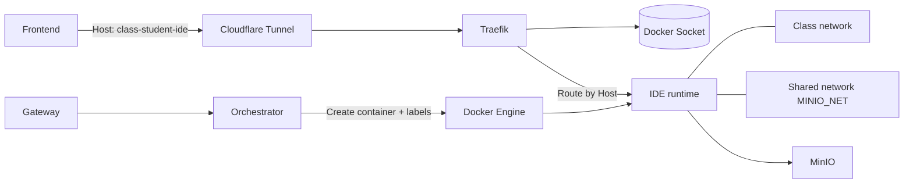

## Quick recap in 3 points

By the time Post 3 was done, I could finally “control the runtime lifecycle”: open a class to provision sandboxes, close a class to collect submissions and clean everything up. It sounded complete… until I had to demo from the public Internet.

This post is how I moved forward without turning the MVP into a never-ending infrastructure project:

- I used **Cloudflare Tunnel + a wildcard domain** to get a stable Internet entry point, instead of handling NAT/TLS/firewalls from day one.
- I used **Traefik (Docker provider) + labels** as a “routing contract”: when a container appears, the route appears; when it disappears, the route is removed automatically.
- The goal is still **class-level isolation**, but because the MVP needs each runtime to join **MINIO_NET** for submission/sync, I accepted the trade-off consciously—along with a roadmap to harden it later.

---

## Once runtimes worked, a new problem showed up

On a LAN, reaching code-server via an IP/port is trivial. But once I exposed it to the Internet, three painful issues became obvious.

First, runtime containers are created and destroyed based on the *open class / close class* workflow, so **their IPs change constantly**. If the front-end depends on IP/port (or the back-end maintains an IP/port mapping table), a simple restart/recreate can desync the system.

Second, if I “publish a port per student” to make it reachable externally, I immediately inherit a different operations problem: port allocation, collisions, cleanup, firewall rules… At a slightly larger scale, it becomes exhausting.

Third—and most importantly—the MVP requirement was actually clear: students need **a stable endpoint** to access their IDE, while “where the container lives” must automatically follow the lifecycle.

In short: I didn’t want to manage routing as a separate piece of state. It should live and die with the container.

---

## Opening the Internet door: choosing Cloudflare Tunnel

At this stage I had two directions:

- Build a public endpoint myself (NAT/TLS/certs/firewalls) and manage routing end-to-end.
- Use something that “opens the door quickly” so I can focus on the project’s core workflow.

I chose Cloudflare Tunnel because it gives a **stable entry point**: traffic goes through Cloudflare and is forwarded to the origin. The best part is I didn’t need to solve every networking concern upfront.

With the free plan constraints, I went with a **wildcard domain** instead of creating countless subdomains. I encode identity into the hostname using a simple convention:

`classId-studentId-ide.<DOMAIN_SUFFIX>`

The key is: **the Host header survives the tunnel and reaches the reverse proxy**. As long as Host remains intact, routing to the correct runtime doesn’t depend on IP/port at all.

---

## Splitting traffic paths to keep operations sane

I intentionally separated two types of traffic so each component does one job well:

- **Gateway** handles control-plane requests: authentication, authorization, open/close class, business logic.
- **Traefik** handles data-plane traffic: students reaching their IDE runtimes.

This separation made debugging faster than I expected: I can quickly tell whether the problem is in the control plane (orchestration API) or in the data plane (routing into runtimes). During demos and real deployments, that clarity saves time.

---

## The routing contract: let labels describe how to reach a runtime

Instead of maintaining an IP/port registry, I let the orchestrator attach “how to route to this container” *at container creation time*.

Traefik’s Docker provider watches Docker events and builds a routing table from labels. Routing becomes a natural extension of the container lifecycle: create a container, get a route; delete it, the route disappears.

### Minimal Traefik configuration

```yaml
# traefik.yml
providers:
  docker:
    endpoint: "unix:///var/run/docker.sock"
    exposedByDefault: false

entryPoints:
  web:
    address: ":80"
```

### Hostname convention

Here’s a simplified version of how I build the FQDN. The only real requirement is that it remains DNS-safe and follows the wildcard constraint:

```js
function buildStudentFqdn({ classId, studentId }) {
  const sub = `${slugifyDns(studentId)}-${slugifyDns(classId)}-ide`;
  return `${sub}.${normalizeSuffix(DOMAIN_SUFFIX)}`;
}
```

### Core labels

```js
function buildTraefikLabels({ routerKey, fqdn, networkName }) {
  return {
    "traefik.enable": "true",

    // critical: force Traefik to use the correct network path into the container
    "traefik.docker.network": networkName,

    [`traefik.http.services.${routerKey}.loadbalancer.server.port`]: "8080",
    [`traefik.http.routers.${routerKey}.rule`]: `Host(\`${fqdn}\`)`,
    [`traefik.http.routers.${routerKey}.entrypoints`]: "web",
  };
}
```

If you ask which line is the “money line”, for me it’s `traefik.docker.network`.

---

## Operations lesson: if you don’t pin the network, you buy a hard-to-debug outage

My runtime containers don’t only join the class network; they also join an additional network to support shared services. The catch is that when a container belongs to multiple networks, Traefik **may pick the wrong one** for routing.

The symptom is nasty: the Host rule looks correct, the service port looks correct, the container is running… yet you intermittently get **Bad Gateway**.

After a few rounds of chasing ghosts, I learned a very practical lesson:

> Dynamic routing is not just about rules (Host/Path). It’s also about the *physical path* through Docker networks.

And the simplest way to prevent that class of failure is to always set `traefik.docker.network` to the network Traefik should use to reach the runtime.

---

## Class isolation and the MINIO_NET trade-off

### Class-level isolation

The direction I want is: **one Docker network per class** (`networkName`). Each runtime container lives inside its class network and **does not publish ports to the host**. The only entry point is Traefik routing by Host.

That gives a clear boundary: class A is not in the same network topology as class B.

### MVP trade-off: a shared network for MinIO

When it came to collecting submissions and syncing workspaces, the runtime needed stable access to MinIO. For the MVP, the fastest path was to let runtimes also join `MINIO_NET`.

The trade-off is real: when many containers share `MINIO_NET`, from Docker’s internal networking perspective, containers **may be able** to reach each other if they know how to address one another.

I accepted this technical debt for two reasons:

- It makes the end-to-end flow reliable for demos and repeated tests.
- It dramatically reduces “infrastructure building time” during the MVP phase.

But I also treat it as a deliberate debt to pay down once the system has real users or is exposed publicly.

---

## What got noticeably better after multiple test cycles

I don’t have a clean “milliseconds benchmark”, but the operational benefits were obvious across many restart/recreate runs:

- The endpoint remains stable (hostname-based), independent of IP/port.
- No need to allocate a port per student.
- No need to store an IP/port registry in the database.
- Faster debugging: hostname + labels quickly reveal whether traffic is taking the right path.

Design-wise, this is what I liked most: instead of managing routing as a separate system, I let it **self-update with the container lifecycle**.

---

## Next steps to harden security

Once the MVP is stable, the upgrades I already planned include:

- Restrict east-west traffic in `MINIO_NET` (allow only MinIO access).
- Split “submission collection” into a dedicated layer (agent/collector) so runtimes don’t need to join a shared network.
- Enable authentication for IDE runtimes and apply per-class/per-student policies.

---

## Overall flow diagram


