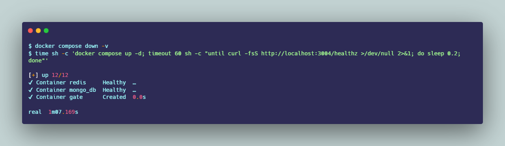
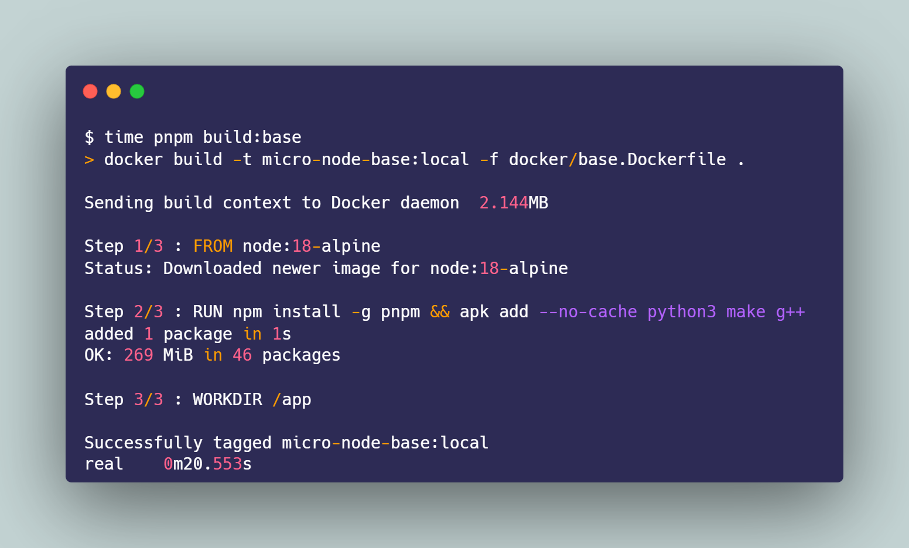

**Author:** Felix Doan  
**Repo:** https://github.com/FelixxDoan/Container-as-a-Service

---

In the previous posts, I focused on architecture and the core techniques to make Container-as-a-Service *work*. In this final one, I want to “land” the series with a more practical angle:

**An MVP that runs is not the same as being “done.”**

With the same stack, a completely fresh machine can feel *heavy*, yet once you’re in rhythm it becomes *smooth*—if the workflow is designed correctly. So the goal of this post is to show two things recruiters (and I) care about:

- I **know** where the bottlenecks are: image/deps/bootstrap.
- I **design a workflow** that makes the dev loop faster over time, instead of “it runs, ship it.”

## What I measure, and how I measure it

At first, I measured something like “how long until containers are Up,” but I quickly realized:

> **Up ≠ Ready.**

A container being `Up` only means the process is running. It doesn’t mean the app is ready to serve requests (waiting for Redis/Mongo, initializing middleware, watchers, seeding, etc.). So I switched to a more practical metric:

- **TTFR (Time-to-First-Request)**: from `docker compose up -d` until `curl /healthz` returns OK.

The gateway exposes:

```bash
GET /healthz  ->  { ok: true, service: "gateway" }
```



## Why “first startup” is slow: dependencies + toolchain

This project is a monorepo with multiple services (gateway, auth, user, class, admin, portal UI…). My goal is very simple:

> Run the whole stack for development with a single `docker compose up`.

But on a completely fresh machine, the first run is always slow because:

- Pulling base images (Mongo/Redis/MinIO/Traefik…)
- Creating volumes for the first time
- Hydrating dependencies (especially native modules that need a toolchain)
- Dev mode uses `nodemon` (in `devDependencies`) → if deps drift, services crash immediately

Instead of “hiding” it, I chose to acknowledge it and optimize in a realistic way:

- A slow **first run** is normal.
- But the **next runs** must be fast—and that speed comes from proper caching and volume design.

## Step 1: build a shared base image to reduce duplicated setup

A major cost in a monorepo is that each service needs the same Node environment + toolchain to build native dependencies (`python/make/g++`). If each service installs its own prerequisites, the setup cost multiplies.

My solution: a **shared base image** for the entire stack—install Node + pnpm + toolchain once.

Cold build of the base image (fresh machine):



> The message here: “pay the base-image build cost once, in exchange for a consistent environment and fewer surprises across many services.”

## Step 2: speed up the dev loop with volumes (pnpm-store + node_modules)

My targets:

- Hot reload (mount source),
- but **no reinstalling deps** every time I `up`.

In `docker-compose.dev.yml`, I do:

- Mount the whole repo into `/app` for hot reload.
- Split volumes for caching:
  - `pnpm_store` (pnpm store cache),
  - `root_node_modules`,
  - and per-service `*_modules` (gateway/auth/user/…).

On top of that, I added a **stamp + lock** mechanism:

- A stamp stores the hash of `package.json`
- A lock prevents multiple services from installing at the same time
- If the hash didn’t change and `node_modules` exists → skip install

Result: after the first hydrate, the stack becomes noticeably “warm.”

## A crucial benchmarking detail: `docker compose down` vs `down -v` (easy to measure wrong)

When I started benchmarking, I noticed a small detail that changes everything: **whether I wipe volumes or not**.

- `docker compose down` stops and removes containers/networks. **Volumes remain**, so Redis/Mongo (and related state) are preserved.
- `docker compose down -v` removes volumes too. Next run is a **fresh bootstrap**: new volumes + re-initialized state/data, typically slower to become ready.

### What I observed

**Scenario 1 — Warm restart (keep volumes):**


**Scenario 2 — Wipe volumes (fresh bootstrap):**


> Lesson learned: when benchmarking a dev loop, I always state whether `-v` was used, because these are two different stories: **warm restart** vs **fresh bootstrap**.

## A small but valuable incident: ESM vs CommonJS in a workspace

While measuring TTFR, I hit an issue that looked like networking but was actually a runtime crash:

- Gateway crashes → `curl /healthz` returns `connection reset`

The root cause was module format mismatch inside the workspace:

- `packages/db` was written as ESM (`export const redis...`)
- but `packages/db/package.json` **missed** `"type": "module"`
- Node treated `.js` as CommonJS → named import/export fails → gateway dies at boot

The fix was tiny (add `"type": "module"`), but the lesson is big:

- In a monorepo, **one package’s module type mismatch** can take down runtime.
- These “small” issues are exactly where a project shows production mindset: detect fast, fix cleanly, learn and prevent repeats.

## Short roadmap

I don’t want to promise “deploy to Kubernetes” just to sound impressive. My roadmap prioritizes what makes the project more reliable:

- Clearer health/ready checks for the gateway and key services
- Minimal logging/audit trail (especially gateway/auth)
- Cleanup/TTL for resources (containers/volumes/temp artifacts) so demos don’t “accumulate trash” over time

When (and only when) there’s a real scaling need (multi-node, scheduling, auto-heal…), that’s when I’ll consider K8s/ECS.

## Closing

If the previous posts answered “how do I make CaaS run?”, this post answers the next question:

> **How do I make it smooth, measurable, and repeatable?**

For me, that’s the line between a “works on my machine” assignment and a project that’s **reliable enough to keep building on**.
