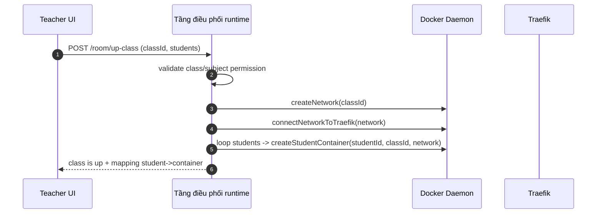
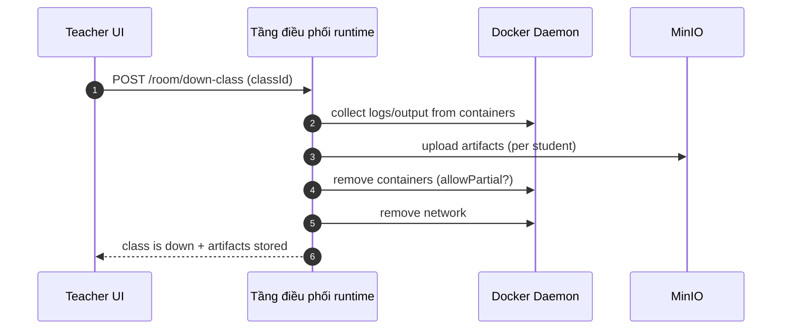

## TL;DR

- Không có endpoint **tạo container tùy ý**. Hệ thống chỉ có hai hành động nghiệp vụ: **Up class** và **Down class**.
- **Up class** = tạo network riêng cho lớp → kết nối Traefik → tạo container cho từng sinh viên theo roster hợp lệ.
- **Down class** = thu bài trước (collect output/log → upload MinIO) rồi mới cleanup container/network để tránh mất dữ liệu.

> Nếu bạn đang tìm “tạo container bằng API như cloud service”, bài này không đi theo hướng đó. Đây là orchestration có kiểm soát trong bối cảnh lớp học.

---

## Nối tiếp Post 2: Khi dữ liệu đã tách đúng chỗ, runtime phải “bật/tắt” thế nào?

Ở **Post 2**, mình giải quyết chuyện “dữ liệu nên nằm ở đâu cho đúng tính cách”:

- MongoDB giữ **metadata**
- Redis giữ **session có TTL**
- MinIO giữ **file/artifacts** theo prefix để UI hiển thị nhẹ hơn

Nhưng đến đây sẽ có câu hỏi tiếp theo rất thực tế:

> Storage đã ổn. Vậy sandbox runtime (Docker) được bật/tắt ra sao? Ai được phép làm việc đó? Và làm sao backend nói chuyện được với Docker Daemon mà vẫn giữ được permission boundary?

Bài này là câu trả lời cho phần runtime đó.

---

## Thuật ngữ trong bài

Trong repo, phần điều phối runtime nằm ở service `class-api`. Tuy nhiên để người đọc mới dễ theo dõi, bài viết sẽ gọi nó theo **vai trò kỹ thuật** là:

- **Tầng điều phối runtime**: service nội bộ điều khiển Docker lifecycle (network, container, routing) theo nghiệp vụ lớp học.

Từ đây trở đi, mình dùng “tầng điều phối runtime” để nói về đúng thành phần đó.

---

## Context: CaaS “giáo dục” không thể giống CaaS “cloud”

Lúc đầu mình cũng nghĩ orchestration đơn giản là: “tạo container cho người dùng chạy code”.

Nhưng đặt vào môi trường lớp học, bài toán đổi hẳn:

- Sinh viên cần sandbox để thao tác trong container, nhưng **không có quyền tạo container**.
- Giáo viên có quyền “bật lớp”, nhưng cũng **không phải muốn tạo gì cũng được**: chỉ bật môi trường dựa trên **môn/lớp đã đăng ký** và **danh sách sinh viên hợp lệ**.

Vì vậy trọng tâm của bài này không phải “orchestration kiểu Kubernetes”, mà là:

**Tầng điều phối runtime** đóng vai trò **cấp phát có kiểm soát** (controlled provisioning).

---

## Vấn đề: Nếu expose “Create Container API” thì hệ thống sẽ tự phá

Nghe thì tiện, nhưng nếu tạo endpoint kiểu `POST /containers` cho client gửi `image/cmd/env` tùy ý, thì ngay lập tức:

- Permission boundary biến mất: bất kỳ ai gọi API cũng có thể tạo container.
- Mất “điểm neo nghiệp vụ”: container này thuộc lớp nào? sinh viên nào? tạo vì mục đích gì?
- Cleanup trở thành ác mộng: không biết thu bài ở đâu, không biết dọn theo classId thế nào cho sạch.

Nói ngắn gọn: **CaaS cho giáo dục không thể là cloud container service thuần túy.**

---

## Kỹ thuật lõi: Node.js nói chuyện Docker Daemon như thế nào?

### Dockerode + docker.sock

Giải pháp kỹ thuật là dùng **Dockerode**, nói chuyện với Docker Daemon qua UNIX socket:

- `/var/run/docker.sock`

Điểm này “hardcore” theo nghĩa: backend có thể gọi Docker API trực tiếp, không cần shell-out `docker ...` lặt vặt.

Nhưng đi kèm là một sự thật quan trọng:

> Service chạm được vào `docker.sock` gần như nắm quyền rất lớn trên host Docker.

Vì vậy khả năng này **không được mở cho user**, mà được đóng lại sau nghiệp vụ **Up/Down class**.

---

## Thiết kế API thực tế: Không có “Create Container” — chỉ có Up/Down class

Thay vì endpoint dạng infrastructure, tầng điều phối runtime được thiết kế theo **hành động nghiệp vụ**:

- **Up class**: bật môi trường cho lớp (network + Traefik + containers theo roster)
- **Down class**: thu bài rồi tắt môi trường (collect → upload → cleanup)

Input vì thế cũng thay đổi:

- Không nhận `image/cmd/env` tùy ý từ client
- Nhận **`classId` + danh sách sinh viên + loại phòng/lab (nếu có)**

Service chỉ cấp phát thứ nó **được phép** cấp phát.

---

## Flow 1: Up class (orchestration theo nghiệp vụ giáo viên)

Ở mức orchestration, “Up class” không chỉ là tạo container. Đây là chuỗi hành động có thứ tự:

- Xác thực quyền giáo viên theo lớp/môn
- Tạo network riêng cho lớp
- Gắn Traefik vào network để route
- Tạo container cho từng sinh viên theo roster hợp lệ
- Start và trả mapping `student → endpoint/container`



### “Xương sống” orchestration (pseudo-code)

Pseudo-code bên dưới nhấn vào tư duy và thứ tự xử lý (đúng luồng thực tế), tránh hiểu nhầm rằng client gửi Docker config tùy ý.

```ts
async function upClassWithStudentContainers({ classId, students }) {
  // 1) network riêng cho lớp
  const networkName = await createNetwork(classId);

  // 2) gắn Traefik vào network để route vào container sinh viên
  await connectNetworkToTraefik(networkName);

  // 3) tạo container theo danh sách sinh viên (cấp phát có kiểm soát)
  const containers = [];
  for (const studentId of students) {
    const c = await createStudentContainer({
      classId,
      studentId,
      networkName,
      // image/template/limits: lấy từ danh sách cho phép (server-side),
      // không nhận tùy ý từ client
    });
    containers.push(c);
  }

  return { networkName, containers };
}
```

---

## Flow 2: Down class (thu bài trước khi cleanup)

Đây là phần “đúng chất lớp học” và cũng là phần dễ sai nhất nếu làm vội.

Nếu cleanup trước rồi mới collect output, dọn xong là mất bài.

Luồng mình chọn:

- Collect logs/output/artifacts từ container
- Upload lên MinIO theo cấu trúc rõ ràng
- Cleanup containers
- Remove network
- Trả trạng thái + thông tin artifacts stored



### Liên kết trực tiếp với Post 2 (MinIO)

Ở Post 2 mình đã đổi chiến lược lưu file sang **lưu từng file theo prefix** để UI lấy đúng file cần thiết, không cần zip/giải nén.

Post 3 gắn điều đó vào runtime bằng một nguyên tắc vận hành:

> Down class không chỉ tắt container. Down class là “thu bài có cấu trúc” rồi mới dọn tài nguyên.

---

## Kỹ thuật nhỏ nhưng “đáng tiền”: đặt tên/label để teardown sạch

Một bài học khi làm lifecycle:

- Nếu container/network không “gắn” với `classId/studentId`, teardown rất dễ sót.
- Nếu có quy ước naming/label rõ ràng, dọn theo classId gần như một nút bấm.

Đây là cách biến orchestration từ “một đống Docker calls” thành “hành vi có quản trị”.

---

## Trade-offs

- **Ưu điểm:** permission boundary rõ ràng. Sinh viên không thể lạm dụng Docker. Cấp phát bị giới hạn theo nghiệp vụ lớp học.
- **Đánh đổi:** tầng điều phối runtime trở thành service “nặng trách nhiệm” — vừa hiểu domain (class/subject/student), vừa xử lý lifecycle + edge-case Docker.
- **Thứ tự xử lý sống còn:** collect → upload → cleanup. Sai thứ tự là mất dữ liệu (bài làm).

---

## Kết quả đạt được

- API “an toàn theo thiết kế”: không có đường cho user tạo container tùy ý.
- Dễ quản lý tài nguyên theo lớp: teardown theo `classId` sạch hơn nhiều.
- Output/log có điểm đến rõ ràng (MinIO), phù hợp cho use-case “thu bài / chấm bài / audit”.

---

## Việc muốn làm tiếp

- TTL/GC: lớp up nhưng không down thì tự dọn theo thời gian.
- Quota theo môn/lớp: giới hạn số container + CPU/mem theo policy.
- Chuẩn hóa artifact format để nối chấm bài tự động sau này (CI grader).
