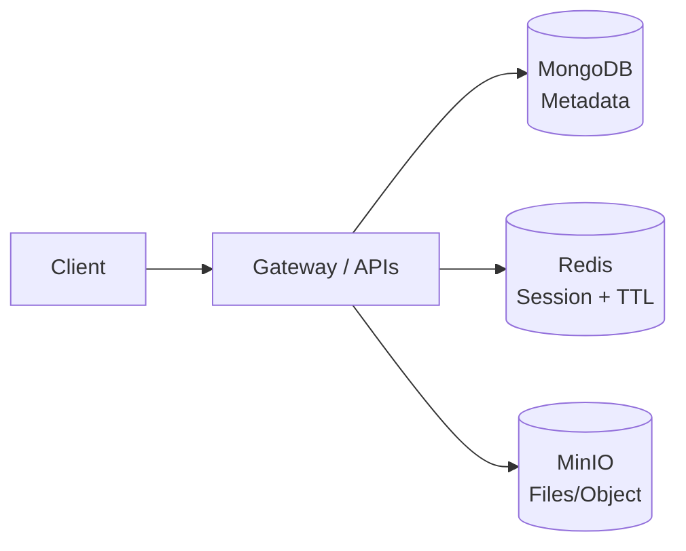
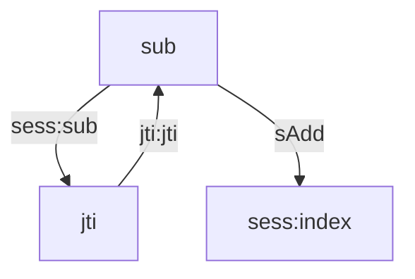

## Bắt nhanh 3 ý chính

Tôi tách dữ liệu CaaS theo đúng “tính cách”: **MongoDB** giữ metadata, **Redis** giữ session có TTL, **MinIO** giữ file bài làm.

- Session: thay vì “đăng nhập thoải mái”, tôi chuyển sang **mỗi user chỉ có 1 phiên active**, ưu tiên giữ phiên hiện tại để tránh vòng lặp phá nhau.
- File: thay vì nén cả folder rồi lưu một cục, tôi chuyển sang **lưu từng file theo prefix**, để UI truy vấn/hiển thị trực tiếp mà không phải tải–giải nén.

## Khi tôi nhận ra “một DB cho tất cả” không ổn

Lúc bắt đầu, tôi nghĩ dữ liệu chỉ là “bản ghi” — nhưng càng đi sâu mới thấy CaaS có ít nhất ba loại dữ liệu sống rất khác nhau:

- **Metadata**: user, lớp, bài tập, deadline… thay đổi theo feature.
- **Session**: dữ liệu nóng, cần expire rõ ràng, có thể revoke nhanh.
- **File**: bài nộp và artifacts, nặng I/O và có thể phình rất nhanh.

Nếu ép tất cả vào một chỗ, hệ thống sẽ có xu hướng… “nghẽn sai nơi”: database phải vừa phục vụ query nghiệp vụ, vừa chịu tải session, vừa gánh file — và chỉ cần một mảng tăng mạnh là kéo cả hệ xuống.

Vậy nên tôi đi theo hướng **polyglot persistence**: tách đúng loại dữ liệu ra đúng storage.



## MongoDB: nơi tôi “để domain tiến hoá” mà không tự làm khổ mình

MongoDB là một hệ quản trị cơ sở dữ liệu **NoSQL**, thuộc nhóm **document database**.

- Dữ liệu lưu dưới dạng **document** (JSON/BSON)
- **Schema linh hoạt**: không bắt buộc mọi bản ghi phải đủ “cột” như SQL
- Dễ mở rộng theo chiều ngang (replication/sharding)
- Phù hợp với các hệ thống backend và microservices nơi domain thay đổi nhanh

Với CaaS, phần metadata thay đổi liên tục theo từng giai đoạn: lúc đầu chỉ cần `User` và `ClassRoom`, sau đó bắt đầu phát sinh “vận hành”: trạng thái lớp, cấu hình runtime, mapping mode theory/exam, liên kết bài tập–submission… Nếu mình dùng schema quá cứng ngay từ đầu, mỗi lần thêm field lại kéo theo một vòng “dọn data” rất mất nhịp.

Điểm mà mình thấy MongoDB cứu mình nhiều nhất là **tốc độ iterate**:

- Có giai đoạn mình thêm/bớt field liên tục để bắt kịp logic vận hành (đặc biệt ở các model liên quan đến classroom lifecycle).
- Mình có thể seed data mới để test tính năng mới mà không cần xoá toàn bộ data cũ, cũng không phải viết migration kiểu “update toàn bộ bản ghi cho đủ field”.
- Những document cũ thiếu field mới vẫn chạy được vì mình set default/optional hợp lý ở layer model + service. Khi cần, mình “backfill” dần theo luồng nghiệp vụ thay vì phải dừng hệ thống để update hàng loạt.

Nói thẳng ra: giai đoạn làm dự án để vừa hoàn thiện feature vừa chỉnh kiến trúc, mình cần một DB cho phép domain thay đổi mà không phá workflow.

**User**

```json
{
  "_id": "ObjectId",
  "email": "user@example.com",
  "role": "student | teacher | admin",
  "profileType": "Student | Teacher",
  "profileId": "ObjectId",
  "createdAt": "Date"
}
```

**ClassRoom**

```json
{
  "_id": "ObjectId",
  "name": "Web Backend - K17",
  "teacherId": "ObjectId",
  "status": "pending | running | stopped",
  "runtimeConfig": { "theoryPort": 30010, "examPort": 30011 }
}
```

**Submission metadata (nhấn mạnh: chỉ giữ reference)**

```json
{
  "_id": "ObjectId",
  "studentId": "ObjectId",
  "homeworkId": "ObjectId",
  "objectKey": "students/<classId>/<hwId>/<studentId>/main.py",
  "createdAt": "Date"
}
```

Tôi cố tình giữ MongoDB “nhẹ”: metadata + reference. File thật để MinIO gánh.

### Trade-off (MongoDB)

- Schema linh hoạt giúp iterate nhanh, nhưng nếu không kỷ luật sẽ dễ “loãng” model: field trùng ý nghĩa, thiếu chuẩn hoá.
- Cách mình tự cứu mình là: đặt quy ước đặt tên field, nhóm field theo mục đích (identity, lifecycle, runtime…), và giữ nguyên tắc “Mongo chỉ giữ metadata + reference”, file để storage khác gánh.

## Redis: câu chuyện “một user – một phiên” và vì sao tôi không chọn đá phiên cũ

Đây là vấn đề thật tôi gặp khi hệ thống bắt đầu có cảm giác “giống thật”.

### Điều làm tôi khó chịu

Trước khi dùng Redis, một tài khoản có thể đăng nhập đồng thời trong một khoảng thời gian, và tôi khó nắm được có bao nhiêu user đang online.

Quan trọng hơn là trải nghiệm phía client: nếu ai đó bị lộ mật khẩu, người khác đăng nhập chen vào có thể gây “quấy” — thao tác người này ảnh hưởng người kia. Tôi muốn hệ thống có khái niệm phiên (session) theo user để kiểm soát.

### Hai cách làm và cái bẫy “vòng lặp phá nhau”

Khi quyết định “mỗi user chỉ có 1 session active”, tôi có 2 lựa chọn:

- **Đá phiên hiện tại, giữ phiên mới**: nghe hợp lý… cho đến khi nghĩ tới trường hợp 2 người cố tình phá nhau — cứ login qua lại, hệ thống tự biến thành vòng lặp vô tận.
- **Giữ phiên hiện tại, từ chối phiên mới (tôi chọn cách này)**: nếu phiên cũ gặp sự cố (user không logout), nó sẽ tự expire theo TTL. Admin cũng có thể revoke nếu cần.

Tôi chọn hướng thứ hai vì goal của tôi là ổn định và kiểm soát được: “phiên đang active là sự thật”, phiên mới không được quyền liên tục đá phiên cũ.

### Thiết kế session store (đủ đơn giản để debug)

Tôi dùng key pattern:

- `sess:<sub> -> jti`: user đang active có session id nào
- `jti:<jti> -> sub`: reverse để revoke nhanh
- `sess:index`: set để liệt kê online (phục vụ admin)



### Snippet cốt lõi: “reserve trước, commit sau” + TTL

```js
// Nếu user đã có session => không tạo session mới (giữ phiên hiện tại)
export async function reserveSession(sub, ttlSec) {
  const key = `sess:${sub}`;
  const pending = `PENDING-${Date.now()}`;

  // NX: chỉ set nếu chưa tồn tại => nếu đã có session thì fail
  // EX: TTL giúp tự dọn nếu pending bị bỏ dở
  const ok = await redis.set(key, pending, { NX: true, EX: ttlSec });
  return ok === "OK" ? pending : null;
}

export async function commitSession(sub, jti, ttlSec, expectedPending) {
  const key = `sess:${sub}`;
  const current = await redis.get(key);
  if (current !== expectedPending) return false;

  // Session thật + reverse index + online index
  await redis.set(key, jti, { EX: ttlSec });
  await redis.set(`jti:${jti}`, sub, { EX: ttlSec });
  await redis.sAdd("sess:index", sub);
  return true;
}
```

Cái tôi thích ở cách này là: TTL “dính” vào vòng đời session ngay từ lúc tạo. Và vì tôi giữ phiên hiện tại, hệ thống tránh được vòng lặp “đá nhau” khi có người cố tình login liên tục.

### Trade-off (Redis session 1 phiên)

- Giữ phiên hiện tại có thể làm người dùng thật sự khó chịu khi họ muốn đăng nhập thiết bị mới ngay lập tức.
- Bù lại, nó chặn được kịch bản xấu nhất: hai người phá nhau vô tận bằng cách login liên tục.

## MinIO: từ “nén cả folder” sang “lưu từng file” để UI đỡ khổ

Vấn đề MinIO của tôi đến từ một chỗ khá đời: test thì ok, nối FE mới thấy đau.

### Lúc đầu tôi làm gì?

Khi seed dữ liệu và kiểm tra trực tiếp qua UI của MinIO, việc nén toàn bộ folder bài làm của sinh viên rồi lưu thành một object nhìn rất gọn:

- upload 1 file zip
- quản lý cũng dễ (một object/1 submission)

Nhưng khi nối FE, tôi mới đụng trúng sự thật: MinIO không phải file explorer cho app của bạn. Bạn không “xem trực tiếp nội dung” theo kiểu đọc một file trong zip.

Muốn hiển thị một file cụ thể cho client, flow trở nên cồng kềnh:

- tải file zip
- giải nén
- tìm đúng file cần hiển thị
- render nội dung

Vừa nặng, vừa chậm, vừa làm FE phải cache và xử lý nhiều thứ không cần thiết.

### Tôi đổi cách lưu: lưu lẻ từng file theo prefix

Tôi chuyển sang lưu từng file, nhưng giữ kỷ luật prefix để không bị loạn.

Ví dụ:

- `students/<classId>/<hwId>/<studentId>/main.py`
- `students/<classId>/<hwId>/<studentId>/README.md`

Nhìn thì có vẻ nhiều object hơn, nhưng đổi lại UI cực “nhẹ”: cần file nào lấy đúng file đó, không phải tải–giải nén.

### Snippet: lấy đúng file cần hiển thị theo objectKey

```js
// Upload từng file
await minio.putObject("students", objectKey, fileBuffer);

// Lưu reference vào MongoDB
await SubmissionFile.create({ studentId, homeworkId, objectKey });

// Khi FE cần xem file cụ thể:
const stream = await minio.getObject("students", objectKey);
return stream;

// Khi cần hiển thị danh sách file, tôi chỉ cần list theo prefix:
const objects = await listObjectsV2(
  "students",
  `students/${classId}/${hwId}/${studentId}/`
);
```

(Ý tưởng là vậy: prefix trở thành “folder logic”, giúp truy vấn đơn giản và predictable.)

### Trade-off (MinIO lưu lẻ từng file)

- Lưu lẻ sẽ tạo nhiều object hơn, và nếu không có quy ước prefix rõ ràng thì dễ rối.
- Đổi lại, FE được lợi lớn: lấy đúng file cần hiển thị, không cần tải zip + giải nén.
- Cách mình giữ hệ thống không “loạn object”:
  - Chuẩn hoá objectKey theo prefix (classId/homeworkId/studentId/…)
  - Tách bạch: metadata nằm ở MongoDB, MinIO chỉ lưu content file
  - (Nếu quy mô lớn hơn) áp dụng lifecycle/cleanup theo deadline hoặc theo policy của lớp

## Những thay đổi tôi thấy rõ sau hai quyết định này

Tôi không ghi con số “nhanh hơn X%” vì để có số chuẩn phải benchmark (p95/p99). Nhưng về trải nghiệm và độ dễ vận hành, tôi thấy rõ:

- Tôi nhìn được user online (từ session index) và có cơ chế revoke.
- Tránh được kịch bản “đá nhau vô tận” khi có người phá bằng cách login liên tục.
- UI hiển thị file mượt hơn vì không còn tải zip + giải nén chỉ để xem một file nhỏ.
- DB nghiệp vụ nhẹ hơn vì chỉ giữ metadata + reference, còn file thật nằm ở object storage.
