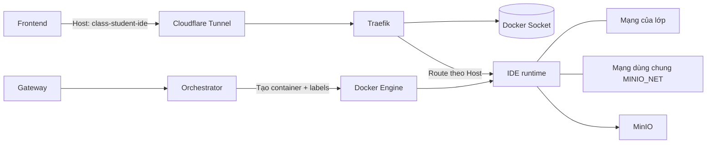

## Bắt nhanh 3 ý chính

Thời điểm Post 3 xong, mình đã “điều khiển được vòng đời runtime”: mở lớp thì cấp phát sandbox, đóng lớp thì thu bài rồi dọn sạch. Nghe có vẻ trọn vẹn… cho đến khi mình cần demo từ Internet.

Và đây là ba quyết định giúp mình đi tiếp mà không biến MVP thành một dự án hạ tầng kéo dài:

- Mình dùng **Cloudflare Tunnel + wildcard domain** để có đường vào ổn định từ Internet, tránh phải tự ôm NAT/TLS/firewall ngay từ đầu.
- Mình dùng **Traefik (Docker provider) + labels** như một “hợp đồng định tuyến”: container sinh ra thì route tự xuất hiện, container mất thì route tự biến mất.
- Mục tiêu vẫn là **cô lập theo lớp**, nhưng vì MVP cần runtime join thêm **MINIO_NET** để thu bài/sync nên mình chấp nhận trade-off có kiểm soát, kèm roadmap siết lại sau.

---

## Sau khi runtime chạy ổn, vấn đề mới xuất hiện

Trong LAN, truy cập code-server bằng IP/port là chuyện đơn giản. Nhưng khi đưa ra Internet thì mình đụng ngay ba thứ “đau”:

Thứ nhất, runtime container tạo/xoá theo nghiệp vụ *mở lớp/đóng lớp* nên **IP thay đổi liên tục**. Nếu front-end bám theo IP/port hoặc back-end tự giữ một bảng mapping thì chỉ cần restart/recreate là dễ lệch trạng thái.

Thứ hai, nếu mình “publish port cho từng sinh viên” để truy cập từ ngoài, mình sẽ sớm bị kéo vào một bài toán vận hành khác: cấp port, chống trùng, nhớ dọn port, mở firewall… Tăng quy mô một chút là thấy mệt.

Thứ ba, thứ mình cần cho demo/MVP lại rất rõ ràng: **một endpoint ổn định** để sinh viên truy cập IDE, còn chuyện “container đang nằm ở đâu” phải tự động chạy theo vòng đời.

Nói ngắn gọn: mình không muốn quản lý “định tuyến” như một state riêng. Nó phải sống cùng lifecycle container.

---

## Mở đường ra Internet: chọn Cloudflare Tunnel

Lúc này mình có hai đường:

- Dựng hẳn public endpoint (NAT/TLS/cert/firewall) rồi tự quản lý routing.
- Dùng một giải pháp “mở đường nhanh” để tập trung vào core flow của dự án.

Mình chọn Cloudflare Tunnel vì nó cho mình **một lối vào ổn định**: request đi qua Cloudflare và forward về origin. Quan trọng nhất là mình không cần giải quyết hết mọi bài toán mạng ngay từ đầu.

Với gói miễn phí, mình đi theo hướng **wildcard domain** thay vì tạo hàng loạt subdomain. Mình encode identity vào hostname theo một quy ước đơn giản:

`classId-studentId-ide.<DOMAIN_SUFFIX>`

Điểm mấu chốt của quy ước này là: **Host header đi xuyên tunnel về reverse proxy**. Khi Host giữ nguyên, mình có thể route đúng runtime mà không phụ thuộc IP/port.

---

## Tách luồng truy cập để đỡ rối khi vận hành

Mình cố tình tách hai loại traffic để mỗi phần làm đúng việc của nó:

- **Gateway** xử lý luồng điều khiển: đăng nhập, phân quyền, mở lớp/đóng lớp, nghiệp vụ.
- **Traefik** xử lý luồng dữ liệu: sinh viên truy cập IDE runtime.

Tách như vậy giúp mình debug nhanh hơn: lỗi nằm ở control-plane (API điều phối) hay nằm ở data-plane (routing vào runtime). Khi demo/triển khai thật, đây là thứ giúp mình tiết kiệm thời gian nhiều hơn mình tưởng.

---

## Hợp đồng định tuyến: để labels mô tả đường vào runtime

Thay vì tự duy trì registry IP/port, mình để orchestrator “đính kèm mô tả định tuyến” ngay lúc tạo container.

Traefik Docker provider theo dõi Docker events, tự xây routing table từ labels. Thế là định tuyến biến thành một phần của lifecycle container: sinh ra là có route, xoá là route tự biến mất.

### Cấu hình Traefik tối thiểu

```yaml
# traefik.yml
providers:
  docker:
    endpoint: "unix:///var/run/docker.sock"
    exposedByDefault: false

entryPoints:
  web:
    address: ":80"
```

### Quy ước hostname

Đây là phiên bản rút gọn logic build FQDN. Mình chỉ cần đảm bảo hostname hợp lệ DNS và bám theo wildcard:

```js
function buildStudentFqdn({ classId, studentId }) {
  const sub = `${slugifyDns(studentId)}-${slugifyDns(classId)}-ide`;
  return `${sub}.${normalizeSuffix(DOMAIN_SUFFIX)}`;
}
```

### Labels cốt lõi

```js
function buildTraefikLabels({ routerKey, fqdn, networkName }) {
  return {
    "traefik.enable": "true",

    // quan trọng: chỉ định Traefik dùng đúng network để đi vào container
    "traefik.docker.network": networkName,

    [`traefik.http.services.${routerKey}.loadbalancer.server.port`]: "8080",
    [`traefik.http.routers.${routerKey}.rule`]: `Host(\`${fqdn}\`)`,
    [`traefik.http.routers.${routerKey}.entrypoints`]: "web",
  };
}
```

Nếu hỏi dòng nào “đáng tiền” nhất, với mình là `traefik.docker.network`.

---

## Bài học vận hành: thiếu “chỉ định network” là tự mua một lỗi khó debug

Container runtime của mình không chỉ join network của lớp, mà còn join thêm mạng khác để phục vụ các nhu cầu phụ trợ. Vấn đề là khi một container có nhiều network, Traefik **có thể chọn nhầm network** để route vào container.

Triệu chứng nhìn rất khó chịu: rule Host đúng, service port đúng, container cũng chạy… nhưng thỉnh thoảng lại **Bad Gateway**.

Sau vài lần “đi vòng”, mình rút ra một bài học rất thực dụng:

> Định tuyến động không chỉ là *rule* (Host/Path), mà còn là *đường đi vật lý* trong Docker network.

Và cách chặn lỗi đó ngay từ đầu là: luôn set `traefik.docker.network` về network mà Traefik có thể reach được runtime.

---

## Cô lập theo lớp và trade-off với MINIO_NET

### Cô lập theo lớp

Thiết kế mình muốn hướng tới là: **mỗi lớp một network riêng** (`networkName`). Runtime container của lớp nào nằm trong network của lớp đó, và **không publish port ra host**. Lối vào duy nhất là Traefik route theo Host.

Mô hình này tạo boundary rõ: lớp A không “thấy” lớp B trong cùng một topology.

### Trade-off ở MVP: mạng dùng chung cho MinIO

Đến đoạn thu bài/sync workspace, mình cần runtime truy cập MinIO ổn định. Với MVP, cách nhanh nhất là cho runtime join thêm `MINIO_NET`.

Trade-off là rõ ràng: khi nhiều container cùng tham gia `MINIO_NET`, về mặt mạng nội bộ Docker, các container **có khả năng** nhìn thấy nhau nếu biết cách gọi.

Mình chấp nhận khoản nợ kỹ thuật này vì hai lý do:

- Nó giúp end-to-end flow chạy chắc để demo và test liên tục.
- Nó giảm rất nhiều thời gian “tự dựng hạ tầng” trong giai đoạn mình cần MVP nhanh.

Nhưng mình cũng ghi rõ: đây là thứ phải harden khi hệ thống có user thật hoặc mở public.

---

## Kết quả mình thấy rõ sau nhiều vòng test

Mình không có benchmark “ms/giây”, nhưng hiệu quả vận hành thể hiện rất rõ qua nhiều lần restart/recreate:

- Endpoint giữ ổn định theo hostname, không phụ thuộc IP/port.
- Không phải cấp port cho từng sinh viên.
- Không phải lưu registry IP/port trong database.
- Debug nhanh hơn: nhìn hostname + labels là biết request có đi đúng “đường” hay chưa.

Từ góc nhìn thiết kế, mình thích nhất điểm này: thay vì quản lý “định tuyến” như một hệ thống riêng, mình để nó **tự cập nhật theo lifecycle container**.

---

## Việc sẽ làm tiếp để siết bảo mật

Khi MVP ổn, các hướng nâng cấp hợp lý mình đã đặt sẵn là:

- Hạn chế east-west traffic trong `MINIO_NET` (chỉ cho phép tới MinIO).
- Tách luồng “thu bài” thành một lớp riêng (agent/collector) để runtime không cần join shared network.
- Bật cơ chế xác thực cho IDE runtime và áp policy theo lớp/sinh viên.

---

## Sơ đồ luồng tổng thể


